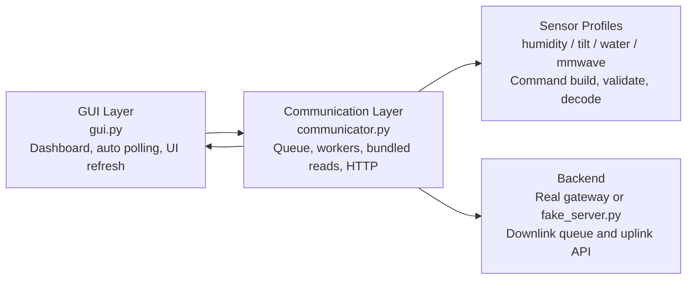
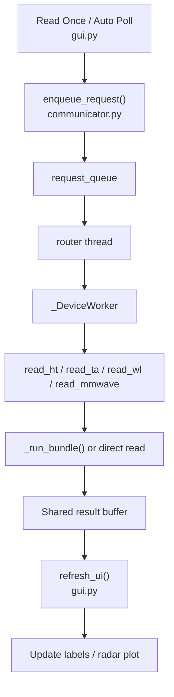

# Architecture

Run with fake server:
```bash
python gui.py --mode fake
```

## High-Level Architecture




## Current Structure

This project is a small desktop dashboard with a threaded communication backend.
The main modules are:

- `gui.py`
  Builds the Tkinter dashboard, handles button clicks, runs auto-read loops, and refreshes the UI from the shared buffer.

- `communicator.py`
  Owns request queuing, worker threads, bundled sensor reads, HTTP communication with the LoRa backend, shared result buffering, and terminal logging.

- `humidity_temp_sensor.py`
- `tilt_acc_sensor.py`
- `water_level_sensor.py`
- `mmwave_sensor.py`
  These profile modules handle sensor-specific request generation and response decoding. The request/response profiles now follow a shared `build_request(mode)` and `decode_response(data, mode)` interface.

- `fake_server.py`
  Simulates the LoRa gateway HTTP API for local testing.

## Runtime Components

### GUI Thread

The Tkinter main thread:

- renders the dashboard
- handles `Read Once` and `Start Auto / Stop Auto`
- periodically calls `refresh_ui()`
- reads the latest buffered sensor results from `communicator.get_buffer_data(...)`

### Global Request Router

`communicator.py` starts one background router thread at import time.
That thread:

- waits on `request_queue`
- takes queued tasks from the GUI
- dispatches each task to the correct per-device worker

### Per-Device Workers

Each device EUI gets its own `_DeviceWorker`.
That worker owns:

- one device-specific queue
- one background thread
- serial execution for all requests for that device

This guarantees that bundled steps for the same device stay in sequence.

### Shared Result Buffer

The latest result for each device/sensor pair is stored in:

```python
buffer[dev_eui][sensor] = result
```

The GUI does not wait directly on network calls.
It only polls this shared buffer and redraws the screen from the newest result.

## Bundled Read Model

`ht`, `wl`, and `ta` are implemented as bundled reads in `communicator.py`.

A bundle is now a list of ordered mode strings.
For each mode, `communicator.py` calls:

- `profile.build_request(mode)`
- `profile.decode_response(data, mode)` when a response is expected

The bundle runner decides whether to wait for a response based on the mode:

- `unlock`
  Send the command only, then continue after a short delay.

- `read`, `angles`, `accel`
  Send the command, wait for an uplink, decode it, and store the decoded result.

Examples:

- `ht`
  One-step bundle with `["read"]`.

- `wl`
  One-step bundle with `["read"]`.

- `ta`
  Multi-step bundle:
  1. `unlock`
  2. `angles`
  3. `accel`

`mmwave` is currently handled separately because it only pulls the latest uplink and does not use the same request/response flow.

## Backend Modes

The backend is selected in `gui.py` through:

```python
communicator.configure_backend(mode)
```

Modes:

- `real`
  Uses the real LoRa gateway API.

- `fake`
  Uses the local fake server at `http://localhost:5000/api`.

## Message Flow


